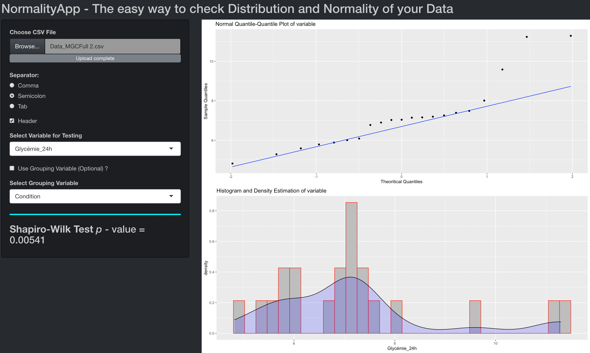
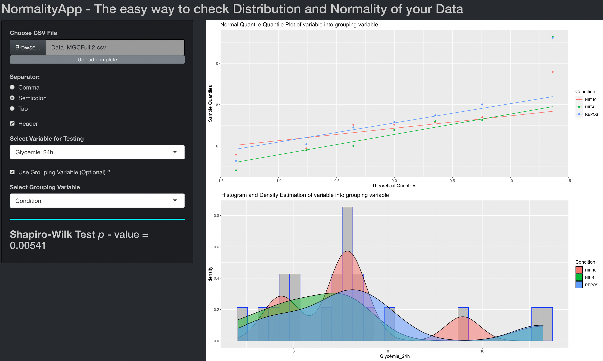

# NormalityApp
##The easy way to check distribution and normality of your data
	      


## Usage

This Shiny app is designed to provide a quick view of distribution and normality of your data. Moreover, this Shiny app is very easy to use.
![]
Simply upload your data (.csv file / text file), select separator, selselect the variable you wish to test, and the app will provide:
```
- The p-value of the Shaprio-Wilk test
- A visualization of the distribution density (`statdensity`)
- A normal quantile-quantile plot (`qqnorm`) with a reference line (`qqline`)
```



If you have a grouping variable, check the box and select the grouping variable, and the app will provide :

```
- The p-value of the Shaprio-Wilk test
- A visualization of the distribution density (`statdensity`) splitted by grouping * variable in color-coded subset distributions
- A normal quantile-quantile plot (`qqnorm`) with a reference line (`qqline`) splitted by grouping variable in color-coded subset qqplot
```



	  
## Notes 
	  

Don't hesitate to tell me if you have any issues with the App or if you want help me to make it better 

Enjoy :)

-Axelvgtf
